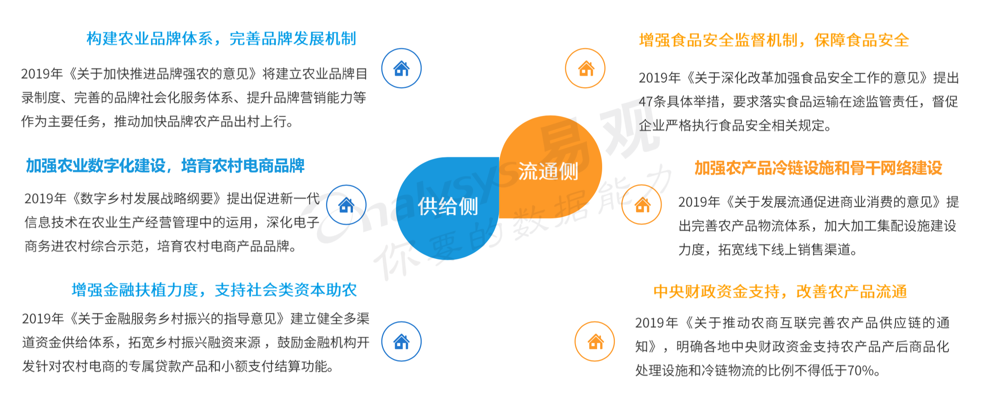
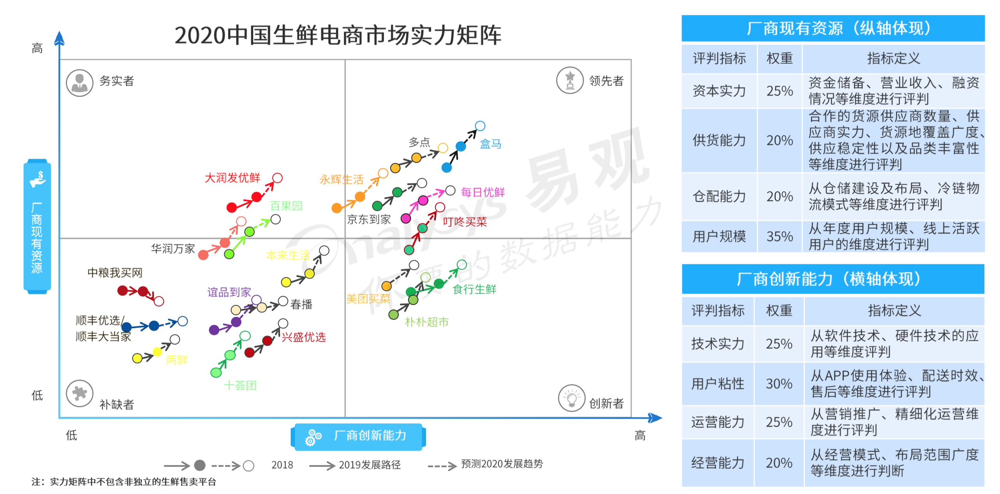

生鲜电商B2C市场，主要包括传统电商渠道生鲜品类市场和生鲜到家业务市场两部分。本文分析内容主要围绕生鲜电商B2C市场的发展环境、市场现状、用户概览、典型厂商、未来启示等维度对2019年生鲜行业进行具体分析。
## 生鲜电商发展环境
### 政策环境

政策推动农产业链优化，生鲜行业基础设施得到改善。

近年来政府对农业生产和流通领域高度重视，据不完全统计，2019年政府层面出台的与农业农产品、冷链物流相关的政策规划超过40项，多维度指导农业和冷链物流健康发展，政策层面促进生鲜行业的基础设施得到优化和改善

### 农业环境
示范村效应促进农村振兴，产业化助力农产品下行

2007年起农业部首次提出重点支持发展“一村一品”示范村镇，而“三品一标”认证工作的开展，推进农产品向高质量，标准化方向发展。截止2019年新增422个示范村中，开展电子商务营销占比86.5%,有利的促进农村产业振兴。

在“农户+合作社+企业”的模式下，农产品产地初加工覆盖面扩大，产业集群正在形成。截止2018年建成15.6座初加工设施，1600多个农产品加工园区（基地），打造552个标准原料基地。

### 物流环境
冷链基础设施不断完善，产业整合生态增强

在生鲜电商的推动下，我们冷链物流需求量增多，带动冷库总量和冷藏车保有量分别提升15.5%和19.4%，冷链基础设施不断完善。但是想较发达国家，当前我国运输过程中采用冷链物流的比重相对较低，冷链基础设施的建设依然薄弱。冷链物流

