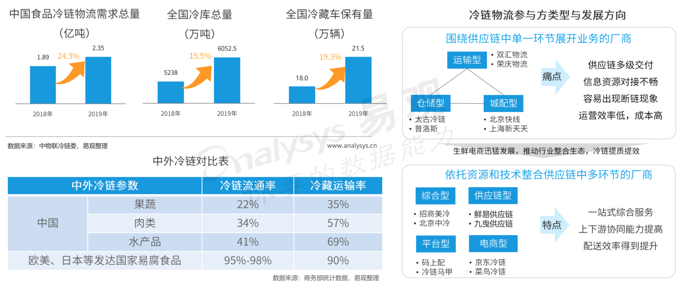

生鲜电商B2C市场，主要包括传统电商渠道生鲜品类市场和生鲜到家业务市场两部分。本文分析内容主要围绕生鲜电商B2C市场的发展环境、市场现状、用户概览、典型厂商、未来启示等维度对2019年生鲜行业进行具体分析。
## 生鲜电商发展环境
### 政策环境

政策推动农产业链优化，生鲜行业基础设施得到改善。

近年来政府对农业生产和流通领域高度重视，据不完全统计，2019年政府层面出台的与农业农产品、冷链物流相关的政策规划超过40项，多维度指导农业和冷链物流健康发展，政策层面促进生鲜行业的基础设施得到优化和改善

### 农业环境
示范村效应促进农村振兴，产业化助力农产品下行

2007年起农业部首次提出重点支持发展“一村一品”示范村镇，而“三品一标”认证工作的开展，推进农产品向高质量，标准化方向发展。截止2019年新增422个示范村中，开展电子商务营销占比86.5%,有利的促进农村产业振兴。

在“农户+合作社+企业”的模式下，农产品产地初加工覆盖面扩大，产业集群正在形成。截止2018年建成15.6座初加工设施，1600多个农产品加工园区（基地），打造552个标准原料基地。

### 物流环境
冷链基础设施不断完善，产业整合生态增强

在生鲜电商的推动下，我们冷链物流需求量增多，带动冷库总量和冷藏车保有量分别提升15.5%和19.4%，冷链基础设施不断完善。但是想较发达国家，当前我国运输过程中采用冷链物流的比重相对较低，冷链基础设施的建设依然薄弱。冷链物流行业上下游的协作以及产业整合生态加强，围绕技术和资源为切入口的冷链方案供应商和电商自建平台以多级共享的以多级共享的运营模式提升了生鲜供应链整体效率。

### 技术环境
新技术赋能生鲜到家全产业链，实现降本增效

新技术在消费端的应用和改造已经非常充分，而在生产和流通端的改造才刚刚起步。伴随着物联网、射频技术的发展，以及5G技术的落地，将推进现代农业产业链的升级，实现生产加工自动化，经营服务信息化，统筹管理智能化，从而提升和改进全链条的效率。

## 生鲜电商市场现状

### 市场规模 

生鲜电商市场稳步增长，未来三年复合增长率达36.3%

2019年生鲜电商B2C市场交易规模为5449.4亿元，未来三年生鲜电商B2C复合增长率达36.3%，预计2022年生鲜电商B2C市场交易规模将达到13811.5亿元，线上生鲜消费市场渗透率将继续提升。2019年通过主流电商平台销售占比达74.8%，相较去年增速达28.2%，而通过生鲜即时到家电商平台销售占比达25.2%，想较去年增速122.7%。

### 融资情况

生鲜领域融资遇冷，连锁社区门店受资本青睐

受大环境影响，2019年与生鲜领域相关融资共40笔，融资金额达77.2亿，相交于去年大幅下降。从融资企业类型看，B2B类型企业融资笔数占比有所提升，TOP5融资厂商中有3家都是具有社区门店，线下社区连锁业态受到资本的青睐。社区团拼赛道全面洗牌，松鼠拼拼、吉及鲜、呆萝卜均遭遇融资失败，十荟团宣布和“你我您”的合并。

### 生态图谱

上下游产业链关系复杂，生鲜电商运营模式各异

### 竞争关系

错位竞争构建生态位，自营和平台双向布局

生鲜电商从中心仓发货的时代，进化到近消费场景的到家业务时代，大浪淘沙后目前市场主流玩家有三类，互联网巨头（阿里、美团、京东）、初创公司（每日优鲜、叮咚买菜、食行生鲜）、连锁商超和社区小店（永辉、多点、百果园）。三类玩家各具优劣势，其之间的市场竞争取决于同区域可提供到家服务的商家数量，现阶段的生鲜到家业务的参与者更多的是围绕自身的模式和拥有的资源强化精细化运营，并通过自建与合作的方式多元化布局，持续培育生鲜到家的市场空间。

### 新入局者

美菜和中石化跨界入局，市场认可度有待验证

新冠疫情影响下，生鲜到家业务火爆，也推动了新玩家的入局，其中以B2B食材供应链服务商美菜和中石化的入局最为让市场期待。尽管二者的资源优势不同，前者更多在供应链方面具有优势，二后者的优势在于线下场景的流量入口，但是二者在末端到家配送能力上存在短板，现阶段又缺乏稳定的具有规模优势的流量来源，市场认可度需要时间去验证。

### 实力矩阵

资源型厂商更具优势，区域精耕企业实力不可小觑

### 运营手段

流量是立身之本，厂商通过多种运营手段提升用户粘性

流量获取主要依赖于营销方式、补贴力度和获取场景等因素，它是生鲜电商是否运转顺畅的重要因素，而流量获取以后的用户留存更为重要，高价拉新的用户不能长期留在平台，会影响平台饿成长性。因此，各平台近年来加大内容运营、品类运营、用户运营的力度，不断提升用户的复购和单个用户的APRU，从而构建更加健康的增长曲线。

内容运营

搭建内容营销生态，促进平台活跃和转化留存

生鲜电商平台越来越注重内容营销，通过图文、短视频、电商直播等多元化的形式，围绕美食故事、烹饪技巧等方面在站内和站外搭建内容营销渠道，让内容成为购买链条中的一个体验环节，从而带来更好的用户体验。优秀的内容营销可以引发用户关注，提升平台用户的活跃度，并促成消费转化，同时内容营销也是生鲜电商品牌与用户深度沟通的有效载体，能够从一定程度上提升用户黏性。

品类运营

围绕生活场景精细化扩展品类，构建差异化商品力

生鲜消费可替代消费渠道众多，消费者容易转移，因此，商品力建设一直是生鲜电商平台运营的重点工作。通过生鲜品类完成引流获客，促进多次复购，利用差异化的特色产品和服务提升客单价，丰富消费体验是目前生鲜电商普遍采取的前端品类构建策略。而在后端建立供应商采购和产地直采多方位结合的采购体系，在补充品类广度的同时，扩展品类运营深度，提升产品毛利空间。

用户运营

重视充值优惠和付费会员制，锁定用户长期价值

为了圈住现有客户群，生鲜电商平台纷纷推出充值优惠和付费会员，由于用户提前预支了费用，必须在平台上持续消费才能将会员利益最大化，因此付费会员也具有高忠诚度、高复购、高客单价的特点。充值优惠更适合以水果、冷鲜为主消费频次低，且客单价高生鲜平台，如百果园、本来生活。付费会员制适合SKU覆盖相对全面，主打买菜的高频消费平台，如盒马、叮咚买菜、食行生鲜等。

供应链能力是扩张之基，新兴厂商重资建设

供应链优势并非短期可以形成，其深度依赖经验和规模，传统连锁商超在生鲜供应链有多年经验，建立了强大的竞争壁垒，以盒马为代表的互联网巨头在极速追赶，而初创公司由于在此方面的经验不足，加上需求馆规模和资金不足等因素，其在采购端的议价能力和配套的物流能力与传统连锁零售业态仍有差距。

数据是核心驱动，用数据洞察提升全链条效率以获得盈利

不论是那种生鲜电商的运营模式，本质上都是为了满足用户对生鲜购买便利性和性价比的需求，盈利的关键在于利用大数据、人工智能等技术赋能生鲜行业前后端，全链条提升企业运营效率，降低运营成本，从而使企业获得更高的盈利水平。数字技术在短期内是耗费成本的，但是在长期规模效应下，这部分投入会被摊薄，但带给企业的增效体质的成效会伴随时间越来越明显，目前互联网巨头和初创公司在数据改善运营效率方面做得相对较好。

## 生鲜电商用户概览

生鲜电商活跃用户和全网活跃用户渗透率均得到提升

在经历了多年用户习惯培养和厂商运营区域的扩张，生鲜电商活跃用户近年实现稳步增长，全网活跃用户渗透率由2017年的2.0%提升到4.2%。2019年全年季度同期增速平均增速超过20%，在新冠疫情影响下，生鲜电商迎来流量红利期，2020年一季度活跃用户相较同期更是增加了65.7%，生鲜电商是移动购物领域最具增长潜力的垂直行业，未来仍有较大的提升空间

用户日活人数扔具有上升潜力，人均单日指标表现良好

伴随着生鲜电商平台品类的扩展和用户精细化运营的深入，2019年生鲜电商行业在日均活跃人数、人均单日启动次数和人均单日使用时长三个维度均实现了不同程度的增长。而在新冠疫情特殊情况影响下，2020年第一季度日活、人均单日指标均显著提升，凸显出生鲜电商行业发展的潜力。

2019年生鲜电商行业女性和24-35岁人群占比均超过半数，91.4%的生鲜电商用户均是中等消费以上消费人群。
相较于2017年，生鲜电商的消费人群属性呈现女性倾斜、高龄占比提升、中高端消费聚拢的特征。

一线城市成为重要增长渗透区域，运营侧重点因城市而异

美食人群在生鲜电商行业的渗透程度和使用深度指标表现优异

美食人群由于和食品有着天然的联系，所以其在生鲜电商行业的活跃人数渗透程度和使用深度均表现相对较高。此外工作人群和旅游人群在活跃人数渗透程度相对表现更加明显，而时尚人群和健康人群的使用深度偏好更高，用户粘性相对更高。

App使用趋于生鲜高频特点，用户平均3-5天使用一次

从厂商角度看，疫情影响下2020年第一季度个厂商的日活人数均实现了不同程度的增长，其中盒马、叮咚买菜、多点相较于2019年提升最多。另外在头部厂商中，2019年单月使用超过4天的商家有6家，其中长期以“买菜”为主打方向的食行生鲜、朴朴超市、叮咚买菜的人均月度使用天数超过6次，用户平均3-5天就会登陆一次，用户粘性更加符合生鲜高频消费特点。

到家业务天花板有峰值运力决定，运营手段提升闲时利用率

在上午10时和下午17时左右，生鲜电商出现明显的波峰，随着午饭和晚饭时间的临近，用户活跃规模也在减少，而在19点以后，生鲜电商用户规模呈现大幅度递减的趋势。

生鲜品类的及时性需求性质决定其销售存在波峰和波谷的差别，同时也导致了配送也会滞后出现闲时和忙时，峰值运力决定了生鲜到家业务的天花板，尽管疫情期间各大生鲜电商平台采取预定时间培东政策有效缓解了高峰期运力紧张，但是并没有从根本上解决问题。目标部分厂商通过更多的运营手段引导用户消费行为，使得活跃用户分配更加合理，从而提升不同时段的运力利用率。

## 生鲜电商厂商分析

### 店仓平台

零售商和平台服务商各取所需，创建共赢生态

传统中大型商超选择高频消费的生鲜品类为扩展线上业务的切入点，在平台服务商的帮助下完成消费者线上触点的改造。而中小型企业则通过平台型服务商的相对标准化的产品服务，快速获得线上流量接口和履约能力。店仓平台模式下，零售商检能更加专注在商品和供应链的管控领域，而服务商则专注于技术研发，帮助零售商找到增量，盘活存量和降本增效的方法，双方共建全渠道生态。

### 店仓自营
进入模式调整期，开店策略分化

以“超市+餐饮到家”为主的中高端生鲜零售体验店，由于前期高速的发展，在供应链、选址、选品、执行等方面积累的问题逐渐暴露，个参与厂商基于盈亏平衡的考虑在不断调整策略。盒马和永辉进行了多种模式探索，其中社区连锁生鲜小店业态最为受到重视。而传统商超陆续开通到家业务，盈利能力逐步提升。

### 前置仓

单店盈利模型成熟，长期盈利依赖规模和效率

### 生鲜到柜

### 

## 生鲜电商未来启示

